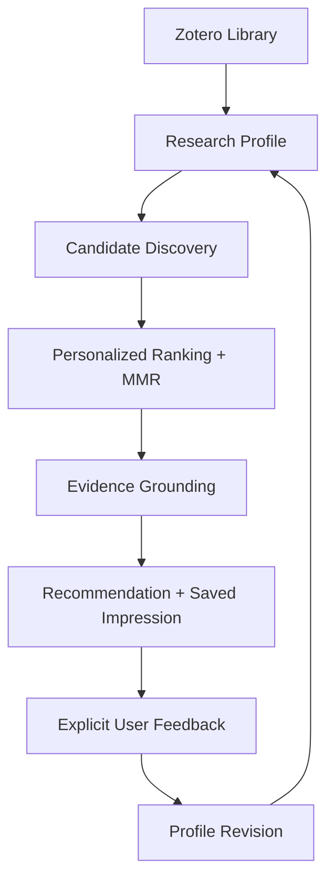

# Zotero Research Intelligence Agent

A personalized research assistant that builds a long-term research profile,
discovers relevant papers, ranks them with explainable signals, and revises
preferences through explicit feedback.

Built on [Yile Wang’s llm-for-zotero](https://github.com/yilewang/llm-for-zotero).
This fork adds a Research Intelligence layer to the existing Zotero Agent and
RAG infrastructure. **Phase 8 is implemented; real Zotero host and live model
validation remain pending.**

[Demo](docs/research-intelligence-demo.md) ·
[Evaluation](docs/research-intelligence-workflow-eval.md) ·
[Development log](docs/development-log.md) ·
[Installation](#installation--existing-usage) ·
[AGPL-3.0-or-later](LICENSE)

## What It Does

Ask **“Based on my research interests, what should I read next?”** The system
uses your Zotero library to build an interest profile, discover external papers,
and return a ranked reading list with traceable evidence. Explicit feedback
revises the profile used by future recommendations.

```text
User
 ↓
Research Intelligence Skill
 ↓
Personalized Recommendation Workflow
 ↓
Grounded Research Digest
```

The engineering focus is a persistent profile → recommendation → feedback loop,
with deterministic ranking, evidence boundaries and testable Agent contracts.
Research Intelligence currently runs in **plugin Agent mode**.

## Architecture Overview



A saved impression records the displayed candidates and profile version, so
feedback can refer to a specific recommendation. Domain services live separately
from Agent tools and the inherited UI/runtime. See the
[architecture baseline](docs/research_agent_architecture_baseline.md).

## Core Capabilities

### 1. Long-term Research Profile

Builds weighted research topics from Zotero library signals, including tags,
collection paths and metadata, with bounded model-assisted topic extraction.
Profiles and explicit preferences persist per library. Existing profiles are
read from storage; an explicit refresh rebuilds them. Updates use
**feedback-driven profile revision**, with deterministic scoring and versioning.

### 2. Personalized Candidate Discovery

Combines profile-derived queries with seed-paper recommendations through the
existing OpenAlex integration. Candidates are merged, deduplicated and filtered
against known library items; query/seed provenance stays attached. Bounded
retrieval and partial-failure warnings make the discovery scope inspectable.
This is a focused recommendation pipeline, not a complete academic search engine.

### 3. Explainable Ranking

| Signal             | Role                                                                         |
| ------------------ | ---------------------------------------------------------------------------- |
| Lexical relevance  | Matches candidate text to weighted interests and an optional focus           |
| Semantic relevance | Uses optional embeddings; falls back when unavailable                        |
| Graph signal       | Uses seed-recommendation provenance and provider rank as a proxy             |
| Recency            | Weights publication age when available                                       |
| Preference         | Applies explicit negative-topic compatibility and feedback-revised interests |
| MMR diversity      | Balances relevance against similarity among selected papers                  |

Ranking is deterministic for fixed inputs, vectors, configuration and time.
MMR (maximal marginal relevance) uses semantic similarity when available and a
lexical fallback otherwise. This is not a trained neural recommender; scores
are selection diagnostics, not probabilities or measures of scientific quality.

### 4. Evidence-Grounded Recommendations

Recommendation results expose matched interests, evidence references, reasons
and confidence limitations. Candidate abstracts support claims about the
candidate; library notes and cached PDF passages provide interest context.
When evidence is insufficient, the pipeline returns `evidence_unavailable` or
zero confidence, and the Skill instructs the model to disclose that limitation.
Titles and ranking scores cannot substitute for evidence of research findings.
Final live-model adherence to these instructions has not yet been validated.

### 5. Feedback Loop

```text
“I like paper 2”
 ↓
recommendation_feedback → confirmation
 ↓
Append-only feedback event → deterministic replay → profile revision
 ↓
Future recommendations
```

Positive, negative, save and skip feedback use deterministic event-based updates.
There is no online model training. A successful profile revision need not change
the next Top-5: results also depend on the candidate pool.

## Agent Workflow

```text
“根据我的研究兴趣推荐5篇值得读的论文”
 ↓
research-intelligence Skill
 ↓
research_recommend
 ↓
Personalized Research Digest
```

Users speak naturally; tool names are shown here for developers. A recommendation
call loads the profile, discovers and ranks candidates, gathers evidence and
saves the impression internally. Profile inspection uses `research_profile_get`;
candidate debugging uses `research_candidate_discover`.

Follow-up feedback resolves the previous list’s rank to saved recommendation and
candidate IDs. Short requests such as “再推荐一次” need recommendation context;
they do not independently activate the Skill by a text-only routing rule. The
Skill can also be selected explicitly with `$research-intelligence` or
`/research-intelligence`.

These four recommendation tools are local to plugin Agent mode. They are not
exposed through Codex App Server, Claude Code, WebChat or the public MCP catalog.

## Demo

This is an **expected interaction script**, not a recorded live demonstration.
Use the same Agent conversation for all four steps.

| Step                | Input                               | Expected behavior                                                                                    |
| ------------------- | ----------------------------------- | ---------------------------------------------------------------------------------------------------- |
| 1. Research Profile | 你觉得我的主要研究方向是什么？      | Show weighted topics and their sources; read an existing profile without refreshing                  |
| 2. Recommendation   | 根据我的研究兴趣推荐5篇值得读的论文 | Return up to five ranked papers with available metadata, interest matches, evidence and source links |
| 3. Feedback         | 第2篇我很喜欢，第4篇不感兴趣        | Resolve the previous ranks and confirm each positive/negative feedback update                        |
| 4. Follow-up        | 再推荐一次                          | Recommend using the revised profile, without an automatic rebuild                                    |

If fewer papers are returned, give feedback only on ranks that exist. Ask
“为什么第1篇适合我？” to inspect available support and limitations. See the
[full demo](docs/research-intelligence-demo.md) for preparation, evidence gaps,
feedback cancellation and import behavior.

## Evaluation Status

### Completed

Recorded Phase 8 results on **2026-09-09**:

| Offline check               | Recorded result                                                     |
| --------------------------- | ------------------------------------------------------------------- |
| Deterministic routing cases | 49 / 49 passed: 27 positive, 22 non-activation cases                |
| Explicit Skill invocation   | 3 / 3 passed                                                        |
| Scripted Runtime contracts  | 3 / 3 passed: recommendation, approved feedback, cancelled feedback |
| Full unit suite             | 4,522 passing / 1 pre-existing pending                              |

The 49 cases exercise regex fallback routing. Expected tool labels are manually
assigned; Runtime tests use a scripted model. **These results do not measure LLM
Tool Selection Accuracy, Agent success rate, or hallucination-free answers.**

The offline evaluation framework implements Precision@K, Recall@K, MRR, NDCG@K,
diversity, novelty and evidence diagnostics. Synthetic fixtures verify formulas
and contracts; they do not establish real-user recommendation quality or an
improvement over a baseline. See the
[workflow evaluation and reproduction commands](docs/research-intelligence-workflow-eval.md)
and [metric definitions](docs/phase7-host-validation.md#指标约定).

### Not Yet Executed

- Real Zotero host validation, including restart persistence.
- Live model workflow evaluation and natural-language multi-turn behavior.
- OpenAlex live provider validation for this recommendation workflow.
- Live embedding validation.
- Group library isolation testing in the real host.

The [host validation checklist](docs/phase7-host-validation.md) records these as
**NOT EXECUTED**. Offline SQLite seams do not replace host validation.

## Project Status

“Implemented” describes the code and offline contracts, not production readiness.

| Component                             | Status                                        |
| ------------------------------------- | --------------------------------------------- |
| Research Profile                      | Implemented                                   |
| Candidate Discovery                   | Implemented                                   |
| Ranking / MMR                         | Implemented                                   |
| Feedback Learning                     | Implemented: deterministic event replay       |
| Recommendation Impression Persistence | Implemented                                   |
| Evidence Grounding                    | Implemented                                   |
| Evaluation Framework                  | Implemented: offline fixtures and diagnostics |
| Research Intelligence Skill           | Implemented: plugin Agent mode                |
| Scheduler                             | Not implemented                               |
| Dedicated Recommendation UI           | Not implemented                               |
| Cross-device Research Profile Sync    | Not implemented                               |

## Engineering Decisions

### No Scheduler Yet

The MVP focuses on an interactive Agent workflow. A periodic digest needs
lifecycle management, notifications and failure handling before it can be
presented as an automatic service.

### No Separate Digest Action

A digest is currently **`research_recommend` + presentation style**. It uses the
same pipeline; there is no separate `research_digest` action. Asking for a weekly
digest neither schedules a job nor guarantees papers published only that week.

### Feedback ≠ Import

“I like this paper” revises preference after confirmation. “Import this paper”
uses the existing Zotero write flow, confirmation and change journal. The
feedback action `save` records preference only. Feedback events use their own
persistent memory path and are not Zotero item edits or journal undo entries.

## Contributions

### Built on Existing Infrastructure

[Yile Wang and the llm-for-zotero contributors](https://github.com/yilewang/llm-for-zotero)
provide the foundation: Zotero integration and UI, Agent runtime, tool/Skill
framework, scholarly search adapters, RAG/PDF and MinerU services, provider
abstraction, confirmation and change journal. This fork reuses that work.

### Added in This Project

The Research Intelligence work adds the personalized recommendation architecture,
persistent research profiles, multi-route candidate discovery, deterministic
ranking and MMR, recommendation impressions, feedback replay and profile revision,
evidence grounding, offline evaluation, and the `research-intelligence` Skill
with routing and workflow contract tests. The
[development log](docs/development-log.md) tracks Phases 1–8 and their boundaries.

## Repository Structure

```text
src/
├─ recommendation/
│  ├─ domain/       # Models and validation
│  ├─ profile/      # Extraction, scoring and persistence
│  ├─ candidate/    # Recall, identity and deduplication
│  ├─ ranking/      # Features, scoring and MMR
│  ├─ evidence/     # Retrieval and grounded reasons
│  ├─ feedback/     # Events, replay and revisions
│  └─ evaluation/   # Metrics and diagnostics
└─ agent/
   ├─ skills/       # Includes research-intelligence.md
   └─ tools/recommendation/
test/               # Domain, SQLite, routing and Runtime contracts
docs/
├─ research-intelligence-demo.md
├─ research-intelligence-workflow-eval.md
├─ phase7-host-validation.md
├─ research_agent_architecture_baseline.md
└─ development-log.md
```

## Installation / Existing Usage

### Build This Fork

Use Node.js 24 and npm to reproduce the documented development environment:

```sh
git clone https://github.com/ck-alpha/zotero-research-agent.git
cd zotero-research-agent
npm ci
npm run build
```

The plugin package is `.scaffold/build/llm-for-zotero.xpi`. Build this fork to try
the Research Intelligence layer; the inherited upstream release link is not a
release of this fork’s additions. Package identity and settings still use
`llm-for-zotero`, including the inherited add-on ID, so this build replaces the
original plugin rather than installing alongside it.

1. In Zotero, open **Tools → Add-ons → gear icon → Install Add-on From File**,
   select the built `.xpi`, and restart Zotero.
2. Open **Preferences → llm-for-zotero**, select a provider and enter its base
   URL, credentials when required, and model; click **Test Connection**.
3. Enable Agent Mode in preferences, then toggle **Agent (beta)** in the
   conversation context bar.
4. Use a test library with topic tags, collections, abstracts and DOI metadata.
   Candidate discovery needs OpenAlex access; embeddings are optional.
5. Follow the [demo](docs/research-intelligence-demo.md). This remains a
   development build awaiting the host and provider checks listed above.

### Development Commands

```sh
npm run typecheck
npm run test:unit
npm run check:cycles
npm run build
```

For a Zotero development session, copy [`.env.example`](.env.example) to `.env`,
set the Zotero binary, development profile and data directory paths, then run
`npm start`. `npm run test:workflow` requires a configured Zotero host. Live
checks are opt-in; their setup is documented in the preserved usage guide.

### Existing Plugin Features and Setup

Paper chat, PDF citations, notes, figures, MinerU parsing and alternative
backends remain inherited features. The
[preserved usage guide](doc/existing-usage.md) retains the previous README’s
configuration instructions, demos, backend setup, privacy details and credits.
Its upstream release and support links refer to the original project.
Alternative backends do not expose this fork’s recommendation tools.

Research-profile extraction may send selected metadata to the configured model;
discovery sends queries and seed identifiers to the scholarly provider. Optional
embeddings use the configured embedding endpoint. Profiles, impressions and
feedback persist locally; external service use depends on configuration.

## Future Work

Possible next steps, without a committed delivery schedule:

- Real Zotero host, restart, group library and live-model validation.
- Periodic research digests and a dedicated recommendation UI.
- Temporal holdout evaluation and live provider/model benchmarks.
- Cross-device research-profile identity and synchronization.
- Recommendation evidence caching.

## License and Attribution

Licensed under **AGPL-3.0-or-later**; see [LICENSE](LICENSE).
Original project: [llm-for-zotero](https://github.com/yilewang/llm-for-zotero),
by **Yile Wang and contributors**, built with the
[Zotero Plugin Template](https://github.com/windingwind/zotero-plugin-template).
The earlier README also credits
[@jianghao-zhang](https://github.com/jianghao-zhang) and
[@boltma](https://github.com/boltma) for Codex App Server, Claude Code and file
upload work; those credits and upstream support links remain in the preserved
guide.

For this fork’s bugs, documentation changes and contributions, use
[ck-alpha/zotero-research-agent issues](https://github.com/ck-alpha/zotero-research-agent/issues)
or submit a pull request to this repository.
