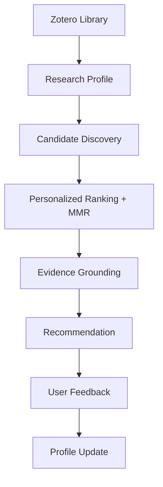

# Codex Prompt — Redesign GitHub README for Research Intelligence Agent

## Project

Repository:

```text
https://github.com/ck-alpha/zotero-research-agent
```

Current state:

Phase 8 has been completed.

The repository is no longer only the original Zotero Agent/RAG project. It now contains a personalized Research Intelligence layer:

```text
Zotero Library
      ↓
Research Profile
      ↓
Candidate Discovery
      ↓
Personalized Ranking + MMR
      ↓
Grounded Evidence
      ↓
Recommendation Impression
      ↓
User Feedback
      ↓
Profile Revision
```

The current README is still the upstream/original project README.

Your task:

> Completely redesign the project README so that the GitHub landing page accurately presents the current project identity, engineering contribution, architecture, demo workflow, evaluation status, and development boundaries.

Do not simply append a section to the old README.

Create a new README structure suitable for:

- GitHub visitors;
- recruiters/interviewers;
- open-source developers;
- researchers interested in Agent systems.

---

# 1. Read Before Editing

Read:

```text
README.md
docs/development-log.md
docs/research-intelligence-demo.md
docs/research-intelligence-workflow-eval.md
docs/research_agent_architecture_baseline.md
docs/phase7-host-validation.md
```

Also inspect:

```text
src/recommendation/
src/agent/skills/
src/agent/tools/
```

Understand which parts are:

## Existing infrastructure

Examples:

```text
Zotero integration
Agent runtime
Tool registry
RAG/PDF infrastructure
provider abstraction
confirmation/change journal
```

## Added Research Intelligence layer

Examples:

```text
ResearchProfile
Candidate Discovery
Personalized Ranking
MMR diversification
Evidence grounding
Recommendation Impression
Feedback Learning
Evaluation framework
research-intelligence Skill
Workflow tests
```

Do not claim ownership of upstream infrastructure that was reused.

---

# 2. README Goal

The README should communicate:

> This project extends a Zotero Agent into a personalized research intelligence system that learns a user's research interests and provides grounded paper recommendations through an Agent workflow.

The README should immediately answer:

1. What is this project?
2. Why does it exist?
3. What is technically novel/interesting?
4. How does it work?
5. How can someone try it?
6. What has actually been validated?
7. What remains future work?

---

# 3. New README Structure

Use this structure.

Do not preserve the old upstream README organization if it conflicts.

---

# Title Section

Create a concise project title.

Example style:

```text
Zotero Research Intelligence Agent
```

Subtitle:

Explain in one sentence:

```text
A personalized research assistant that builds a long-term research profile,
discovers relevant papers, ranks them with explainable signals, and improves
through explicit feedback.
```

Add badges only if they are real.

Do not add fake:

- production badge;
- benchmark badge;
- coverage badge;
- release badge.

---

# Hero Section

Add:

## What it does

Explain the user experience:

Example:

```
Instead of asking:
"search papers about topic X"

the user can ask:

"Based on my research interests, what should I read next?"
```

Then show:

```text
User
 ↓
Research Intelligence Skill
 ↓
Personalized Recommendation Workflow
 ↓
Grounded Research Digest
```

Keep this understandable to non-maintainers.

---

# Architecture Overview

Add a clean Mermaid diagram.

Preferred:



Do not include every internal class.

The README is not an architecture specification.

---

# Core Capabilities

Create a section:

```markdown
## Core Capabilities
```

Include:

## 1. Long-term Research Profile

Explain:

- extracts research interests;
- maintains weighted topics;
- uses existing Zotero knowledge;
- supports feedback updates.

Do not claim autonomous learning.

Use:

```text
feedback-driven profile revision
```

not:

```text
self-learning AI researcher
```

---

## 2. Personalized Candidate Discovery

Explain:

- multiple retrieval signals;
- external paper discovery;
- provenance.

Avoid claiming:

```text
complete academic search engine
```

---

## 3. Explainable Ranking

Explain:

Signals:

```text
lexical relevance
semantic relevance
graph signals
recency
preference signals
MMR diversity
```

Clarify:

- deterministic ranking;
- not a trained neural recommender.

---

## 4. Evidence-Grounded Recommendations

Explain:

Every recommendation exposes:

- why it matches;
- evidence references;
- confidence limitations.

Mention:

The system avoids unsupported claims when evidence is unavailable.

---

## 5. Feedback Loop

Explain:

Example:

```
User:
"I like paper 2"

↓

recommendation_feedback

↓

profile revision

↓

future recommendations
```

Clarify:

This is deterministic event-based updating.

Do not claim online model training.

---

# Agent Workflow

Add:

```markdown
## Agent Workflow
```

Explain natural language interaction.

Example:

```text
User:
根据我的研究兴趣推荐5篇值得读的论文

↓

research-intelligence Skill

↓

research_recommend

↓

Personalized Research Digest
```

Developer tool names may be shown, but explain users do not need to call them manually.

---

# Demo

Create:

```markdown
## Demo
```

Use concise examples from:

```text
docs/research-intelligence-demo.md
```

Include:

## 1. Research Profile

Input:

```text
你觉得我的主要研究方向是什么？
```

## 2. Recommendation

Input:

```text
根据我的研究兴趣推荐5篇值得读的论文
```

## 3. Feedback

Input:

```text
第2篇我很喜欢，第4篇不感兴趣
```

## 4. Follow-up

Input:

```text
再推荐一次
```

Do not include fake screenshots.

---

# Evaluation

Create:

```markdown
## Evaluation Status
```

Be precise.

Include:

## Completed

Example:

```text
Offline deterministic workflow evaluation:

49 / 49 routing and contract cases passed
```

Explain:

This does NOT equal:

```text
LLM Tool Selection Accuracy
```

or:

```text
Agent success rate
```

Use the exact distinction from the evaluation document.

---

## Not Yet Executed

Clearly list:

```text
Real Zotero host validation
Live model workflow evaluation
OpenAlex live provider validation
Embedding live validation
Group library isolation test
```

Do not hide limitations.

This increases credibility.

---

# Project Status

Add:

```markdown
## Project Status
```

Use a table:

| Component | Status |
|---|---|
| Research Profile | Implemented |
| Candidate Discovery | Implemented |
| Ranking/MMR | Implemented |
| Feedback Learning | Implemented |
| Evidence Grounding | Implemented |
| Evaluation Framework | Implemented |
| Research Intelligence Skill | Implemented |
| Scheduler | Not implemented |
| Dedicated Recommendation UI | Not implemented |
| Cross-device Sync | Not implemented |

Keep it honest.

---

# Engineering Decisions

Add:

```markdown
## Engineering Decisions
```

Explain important boundaries:

## No Scheduler Yet

Reason:

Current MVP focuses on interactive Agent workflow.

Periodic digest requires:

- lifecycle;
- notification;
- failure handling.

---

## No Separate Digest Action

Explain:

Digest is currently:

```text
research_recommend + presentation style
```

not another duplicated pipeline.

---

## Feedback ≠ Import

Explain:

```text
"I like this paper"
```

changes preference.

```text
"Import this paper"
```

uses Zotero write flow.

---

# Development Contribution

Add:

```markdown
## Contributions
```

Clearly separate:

## Built on existing infrastructure

and:

## Added in this project

Example:

Existing:

```text
Zotero integration
Agent runtime
RAG infrastructure
Tool framework
```

Added:

```text
Personalized recommendation architecture
Research profile system
Ranking pipeline
Feedback learning loop
Evidence grounding
Evaluation framework
Research Intelligence Skill
```

---

# Repository Structure

Add a concise tree:

Example:

```text
src/
 ├─ recommendation/
 │   ├─ profile/
 │   ├─ candidate/
 │   ├─ ranking/
 │   ├─ feedback/
 │   └─ evaluation/
 │
 └─ agent/
     ├─ skills/
     └─ tools/

docs/
 ├─ research-intelligence-demo.md
 ├─ research-intelligence-workflow-eval.md
 └─ development-log.md
```

Do not include every file.

---

# Installation / Existing Usage

Keep useful upstream setup information.

Do not delete:

- installation;
- build;
- development commands;
- licensing;
- attribution.

Preserve original project credit.

---

# Future Work

Add:

```markdown
## Future Work
```

Possible items:

```text
Real host validation
Periodic research digest
Recommendation UI
Temporal benchmark evaluation
Provider/model benchmark
Cross-device research profile
Evidence caching
```

Do not imply committed roadmap.

---

# Writing Style Rules

The README should be:

- concise;
- technical but readable;
- honest;
- portfolio-quality.

Avoid:

- marketing hype;
- "AI scientist";
- "fully autonomous";
- "production ready";
- unsupported benchmark claims.

Prefer:

- personalized;
- explainable;
- evidence-grounded;
- deterministic;
- workflow-oriented.

---

# Validation Checklist

Before finishing:

```
[ ] README represents current Phase 8 project, not upstream only.
[ ] Existing attribution/license preserved.
[ ] Added capabilities separated from reused infrastructure.
[ ] No fake benchmark claims.
[ ] No fake screenshots.
[ ] No fake production claims.
[ ] Architecture diagram added.
[ ] Demo added.
[ ] Evaluation limitations included.
[ ] Future work clearly separated.
[ ] Markdown renders correctly.
```

---

# Final Report

Return:

1. README structure summary.
2. Major sections added.
3. Claims checked for accuracy.
4. Existing upstream content preserved.
5. Files changed.
6. Validation performed.
7. Any remaining documentation gaps.
